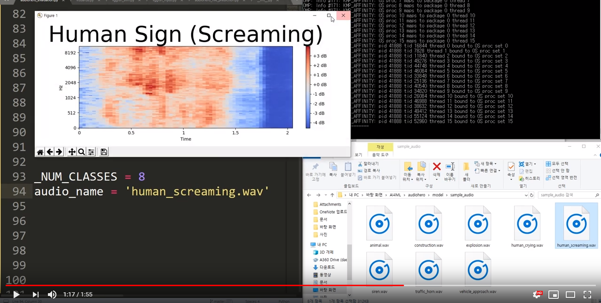

  

# AudioHero
AudioHero is a real-time sound-based danger detection system.

## Ongoing
- [x] Defining a context to use
- [x] Download raw data
- [x] Data Pre-processing
- [x] Featurization
- [x] Modify Network
- [x] Training
- [x] Evaluation
- [ ] Prepare live demo

## DataSet
We use [AudioSet](https://research.google.com/audioset/), a dataset of over 2 million human-labeled 10-second YouTube video soundtracks. We extracted only dangerous sounds on Audioset. Please check [dataset](https://github.com/daehwa/AudioHero/tree/master/dataset) folder in this repository.

## Pre-processing
1. [Pre-processing](https://github.com/daehwa/AudioHero/tree/master/pre-processing/Pre-Processing)
2. [Amplitude Augmentation](https://github.com/daehwa/AudioHero/tree/master/pre-processing/Amplification_Augmentation)
3. [Persistence Augmentation](https://github.com/daehwa/AudioHero/tree/master/pre-processing/Presistence%20Augmentation)
4. [Mixing Augmentation](https://github.com/daehwa/AudioHero/tree/master/pre-processing/Mixing%20Augmentation)

## Result
AudioHero got total 73% classification accuracy over 8 danger situation classes.

  

